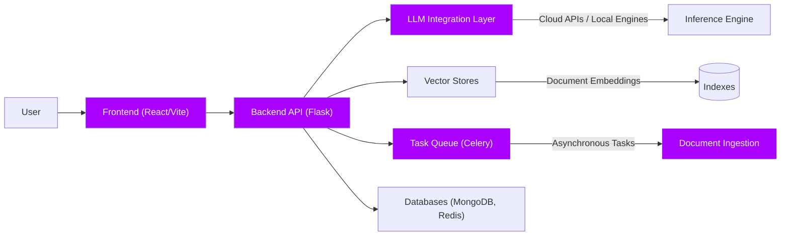
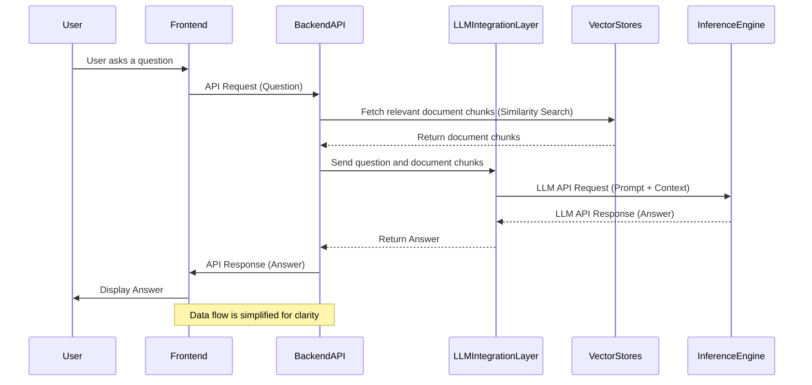
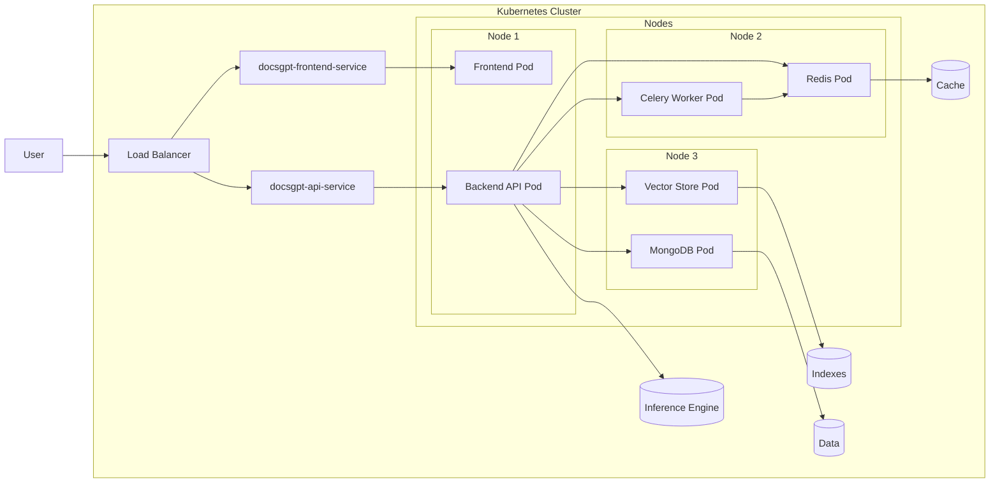

---

title: 架构
description: DocsGPT 的高层架构设计
---

## 项目说明

DocsGPT 被设计为一个模块化且可扩展的知识型生成式AI系统应用。本文档概述了 DocsGPT 的高层架构，重点介绍其核心组件。

## 高层架构

本架构图提供了 DocsGPT 的鸟瞰视图，展示了主要组件及其交互关系。

## 组件说明

### 1. 前端 (React/Vite)

*   **技术栈:** 基于 React 和 Vite 构建
*   **职责:** 作为 DocsGPT 的用户界面，提供问答交互、提示词配置、工具管理及其他设置功能。负责处理用户输入、展示对话历史、显示来源信息以及管理各项设置。
*   **核心特性:**
    *   简洁响应式用户界面
    *   简单的静态客户端渲染
    *   管理对话状态和设置
    *   与后端 API 进行数据获取和处理通信

### 2. 后端 API (Flask)

*   **技术实现:** 采用 Flask (Python) 框架开发。
*   **职责:** 后端 API 作为 DocsGPT 的核心逻辑与协调层，负责接收来自前端、扩展或 API 客户端的请求，处理这些请求并协调各组件间的交互。
*   **核心功能:**
    *   提供处理用户查询、文档上传和设置配置的 API 端点
    *   管理整体应用流程与业务逻辑
    *   与 LLM 集成层、向量数据库、任务队列、工具集、智能代理及数据库进行集成
    *   提供 Swagger 接口文档

### 3. LLM 集成层 (后端组成部分)

*   **技术实现:** 支持多种 LLM API 及本地推理引擎
*   **职责:** 该层为大型语言模型(LLM)交互提供抽象接口
*   **核心功能:**
    *   支持 OpenAI、Google、Anthropic、Groq、HuggingFace Inference API、Azure OpenAI 等云服务，同时兼容 Ollama、LLaMa.cpp、Text Generation Inference (TGI)、SGLang、vLLM、Aphrodite、FriendliAI 和 LMDeploy 等本地模型
    *   管理 API 密钥处理、请求格式化及工具格式化
    *   提供缓存机制以提升响应速度并降低 API 调用量
    *   支持流式响应以实现交互式用户体验

### 4. 向量数据库 (后端组成部分)

*   **技术实现:** 支持多种向量数据库
*   **功能职责:** 向量存储模块负责存储和检索文档分块的向量嵌入。这使得系统能够根据用户查询进行语义搜索并返回相关文档片段
*   **核心特性:**
    *   支持包括 FAISS、Elasticsearch、Qdrant、Milvus 和 LanceDB 在内的向量数据库
    *   提供高维向量嵌入的存储与索引功能
    *   支持向量索引的编辑更新（包括特定文档分块）

### 5. 解析器集成层（后端组件）

*   **技术实现:** 支持多格式文件处理及远程资源上传
*   **功能职责:** 解析器集成层负责文档的上传、解析、分块、嵌入及索引建立
*   **核心特性:**
    *   支持多种文档格式（PDF、DOCX、TXT等）及远程资源（网页URL、站点地图）
    *   处理文档解析、文本分块及嵌入向量生成
    *   采用 Celery 实现异步处理，确保大文档的高效处理

### 6. 任务队列（Celery）

*   **技术栈:** 使用 Celery 搭配 Redis 作为消息代理和后端存储
*   **职责:** Celery 负责异步任务处理，执行文档摄取和索引等耗时操作，确保主应用保持响应高效
*   **核心特性:**
    *   管理文档处理和索引的后台任务
    *   通过卸载繁重任务提升应用响应速度
    *   采用分布式任务处理增强可扩展性和可靠性

### 7. 数据库系统 (MongoDB, Redis)

*   **技术栈:** MongoDB 与 Redis
*   **职责:** 数据库用于持久化数据存储与缓存。MongoDB 存储结构化数据如会话记录、文档、用户设置和API密钥；Redis 同时承担缓存服务和 Celery 消息代理的角色

## 请求流程图解

本流程图展示用户向 DocsGPT 提交问题时的处理步骤序列

## 部署架构

DocsGPT 设计为通过 Docker 和 Kubernetes 部署，以下是简易 k8s 部署方案的快速概览

